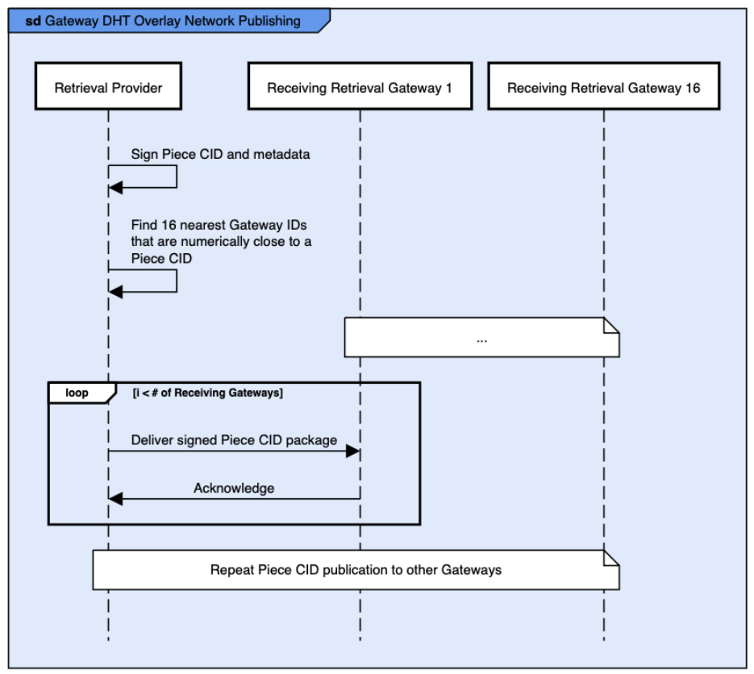

[Back: System Set-up](systemsetup.md)

# Retrieval Provider to Retrieval Gateway Publishing

Retrieval Providers publish Piece CIDs to Retrieval Gateways that they can retrieve content for.  

## CID Group Offer Publishing

Retrieval Providers send CID Group Offers to Retrieval Gateways for recently stored content, to replace CID Group Offers that are soon to expire, and to offer discounted content for a short period of time.

When a Retrieval Gateway receives a CID Group Offer, it needs to verify the information. It does the following:

* Verifies the signature
* Re-calculates the Merkle Root and compares the candidate Merkle Root to the signed Merkle Root.

### CID Group Offer Retention

A Retrieval Provider publishes a CID Group Offer to a Retrieval Gateway, the CID Group Offer can contain any Piece CID that the Retrieval Provider holds. The Retrieval Gateways can choose to cache some, all, or none of the CIDs for a Retrieval Provider. The factors in making the decision are:

* Is the Retrieval Provider configured to be on an Allow List (always store all CIDs) or Block List (never store any CIDs). Retrieval Providers might be added to the Allow List due to off-chain / out of band deals. Retrieval Providers might be added to the Block List as they might host banned content in the jurisdiction that the Retrieval Gateway operates.
* The reputation of the content from the Retrieval Provider. That is, how often have Retrieval Clients asked for Piece CIDs hosted by this Retrieval Provider.
  * The Retrieval Gateway will accumulate reputation scores for Retrieval Providers by observing whether Retrieval Clients set-up payment channels via the Retrieval Gateway to retrieve content from Retrieval Providers.
* The reputation of the Retrieval Provider determined by the amount of Piece CIDs that have had to be obtained via the DHT network, that are available on the Retrieval Provider. 
  * The Retrieval Gateway will accumulate reputation scores for Retrieval Providers for CID locations obtained via the DHT by observing whether Retrieval Clients set-up payment channels via the Retrieval Gateway to retrieve content from Retrieval Providers.
* The latency to the Retrieval Provider. If the latency is high, then the Retrieval Provider is likely to be holding content that might not be as relevant to Clients geographically nearer (and hence with lower latency) to the Retrieval Gateway. Additionally, content may be hosted on multiple Retrieval Providers. As such, the same content may be available in a Retrieval Provider that is closer to the Client.

Publication frequency:

* Providers should publish CID Group Offers quickly so that content is available sooner.
* Providers are likely to publish all Piece CIDs in a storage sector at the same time and separately to other sectors. However, this is not a requirement.

## Retrieval Gateway DHT Overlay Network Publishing and DHT Retention

Retrieval Providers publish Single CID Offers to Retrieval Gateways that only contain Piece CIDs that are numerically close to the Retrieval Gateways’ Ids. 

The process for publication is for each Piece CID:

* Create a Single CID Offer.
* Determine the 16 Retrieval Gateway Ids that are numerically closest to the Piece CID.
* Deliver the Single CID Offer to those Retrieval Gateways.
* Store the acknowledgement sent from the Retrieval Gateway for each offer. Deduct a reputation point if a Retrieval Gateway does not acknowledge some content.

Publication frequency:

* Piece CID information needs to be republished prior to the expiration date.
* Providers should read the Retrieval Gateway Registration Built-in Actors to get the latest list of Retrieval Gateways each 24 hours.
  * This will allow it to detect de-registered Retrieval Gateways.

**Figure 8.** Retrieval Gateway DHT Overlay Network Publishing

[Next: Retrieval Client Content Retrieval](rccontentretrieval.md)