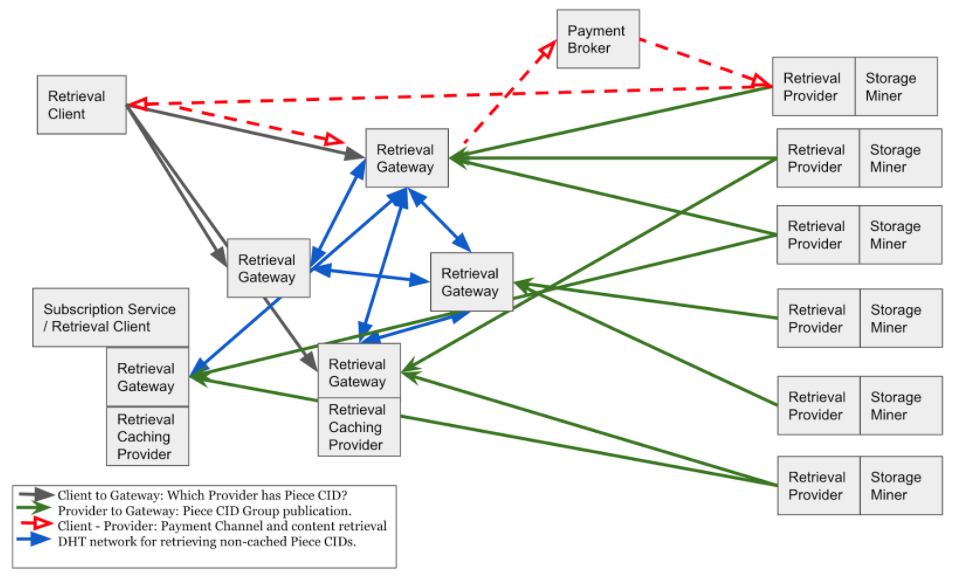

[Back: Attacks Analysis](attacksanalysis.md)

# Appendices

## Appendix: Extended Architecture

This section outlines additional components that we foresee as being important to the Filecoin Secondary Retrieval Market ecosystem. These nodes extend the core architecture without need to change the messages and system design described in the rest of this document. They can be added separately or all together.

Figure 11: Filecoin Secondary Retrieval Extended Architecture

### Retrieval Caching Providers

Retrieval Caching Providers are Retrieval Providers that do not have an associated Storage Miner. A Retrieval Gateway with an integrated Retrieval Caching Provider could decide to fetch and then offer content for the following reasons:

* They want to make more revenue by offering popular content. Retrieval Gateways can see content is popular. They may wish to offer the content themselves.
* They want to make more revenue by offering content at a lower price than current Retrieval Providers are offering the content at. They can see that content is being offered at a high price, and they feel that they could under-cut the price being requested.
* They want to make more revenue by offering content with a better latency than existing Retrieval Providers. They can see that content is being supplied by a Retrieval Provider that has a high latency from them and Retrieval Clients local to them. They can offer the same content with lower latency.

The Retrieval Caching Provider acts as a Retrieval Client to fetch the content. Importantly, the Retrieval Caching Provider is not tied to storing “cold” content via Storage Contracts.

### Subscription Services

Subscription Services could emerge that act as Retrieval Clients. Users pay a subscription fee to the company offering the subscription service, and then the Subscription Service / Retrieval Client fetches content as required. This means that users do not need to own Filecoin tokens to engage with the system. Additionally, it could be imagined that there would be a free subscription tier, offering free or content. It would make sense that such a service provider had their own Retrieval Gateway and Retrieval Caching Provider.

Subscription Services could be viewed as centralization points. The authors feel that it is likely that the service providers would end up being like web email providers: there would be a large variety of providers, with some larger ones. The key difference between email providers and Filecoin providers is that the data is stored in Filecoin. Hence, if a user wanted to change provider, they could, without the concern that all of their data was locked inside the provider’s network.

### Payment Brokers

Retrieval Gateways are unlikely to have payment channels set-up with all Retrieval Providers. Each payment channel requires a deposit on-chain. Need to have thousands of deposits for thousands of providers would be an impediment to becoming a Retrieval Gateway. Specialist nodes known as Payment Brokers could have payment channels set-up with many Retrieval Providers. Retrieval Gateways that don’t have a payment channel set-up with a specific Retrieval Provider could instead create the channel via the Payment Broker.

### Payment via Multiple Retrieval Gateways

An alternative to the use of Payment Brokers is for Retrieval Gateways to review which Gateways have a payment channel set-up with a Retrieval Provider, and offer to pay for the content via a chain of Gateways. In this situation, the Client would pay the first Retrieval Gateway, that would pay the second Gateway, that would pay the Retrieval Provider.

### Rich Search Capabilities

Users wish to be able to locate content based on textual information. This could be used to determine a Piece CID based on some text search term, or determining a CID within a Piece CID based on some text search term. It is envisaged that a separate indexing and search component would exist, separate from the Retrieval Gateway and Retrieval Provider components described in this document.

### Other Features

* Dynamic pricing for servicing CID Discovery messages.

## Appendix: Binary Merkle Tree CID Group Offer Analysis

Assume:

* 100 CIDs per CID Group Offer.
* Message digesting 32 bytes: 6 us.
* Assume for leaves that are zero filled, that message digests are pre-calculated. That is Digest(0, 0) and Digest(Digest(0,0),Digest(0,0) etc are precalculated.
* Calculate Merkle Root: 
  * If there were 128 leaves: 64+32+16+8+4+2+1 = 127 message digests = 762 us approx= 1ms.
  * If there were 100 leaves: 50+26+13+7+4+2+1 = 103 message digests = 618 us approx= 1ms.
* Signing (32 byte Merkle Root + 20 bytes for expiry time, QoS and other stuff) bytes using ECDSA/SHA256 with P256 curve takes around 2 to 3.5 ms. Assume 3ms.
* Signature verification: 2ms.

Retrieval Provider CPU: 

* Calculate Merkle Root for 100 CIDs: 1ms
* Sign CID Group Offer: 3ms
* TOTAL: around 4ms.
* NOTE: CPU usage will go up a probably log2(N) with the number of CIDs in CID Group Offer.

Retrieval Provider to Retrieval Gateway data size:

* 100 x 32 byte CIDs 
* 32 bytes Merkle Root
* 20 bytes for expiry time, QoS and other stuff
* Signature: 71 bytes.
* TOTAL: 3323 bytes.
* NOTE: Bytes used will go up linearly with the number of CIDs in CID Group Offer.

Retrieval Gateway CPU: 

* Check Merkle Proof: 1ms
* Verify CID Group Offer: 2ms
* TOTAL: around 3ms.
* NOTE: CPU usage will go up less than log2(N) the number of CIDs in CID Group Offer.

Retrieval Gateway to Retrieval Client when sending a proof data size:

* 1 x 32 byte CID (probably helpful to echo this back in the response).
* 32 bytes Merkle Root + 
* 5 x 32 bytes of Merkle Proof + 
* 1 byte: id / location of CID within Merkle Tree + 
* 20 bytes for expiry time, QoS and other stuff
* Signature: 71 bytes.
* TOTAL: 316 bytes.
* NOTE: Data size will go up less than log2(N) the number of CIDs in CID Group Offer.

Retrieval Client CPU: 

* Verify Merkle Proof: .1ms
* Verify CID Group Offer: 2ms
* TOTAL: around 2ms.
* NOTE: CPU does not depend on the number of CIDs in CID Group Offer.

Retrieval Client to Retrieval Provider when requesting CID and sending proof data size:

* Retrieval Gateway to Retrieval Client 

## Appendix: Number of CIDs Per Retrieval Gateway for DHT

The message digest part of Piece CIDs are randomly distributed. As the message digest is of content itself, it is impossible to orchestrate the Piece CID value.

Retrieval Gateway Ids are the message digest of the Retrieval Gateway’s Root Public key. A new Retrieval Gateway could look at all of the Retrieval Gateway Ids currently deployed and determine that the set of Retrieval Gateway Ids is not evenly distributed across the number space. They would realise that having a Retrieval Gateway Id in a part of the number space that is under-represented, that is in a “gap”, is likely to be more profitable than being in a part of the number space that is over-represented. Given this, the Retrieval Gateway Id space is likely to converge towards an even distribution.

The equation below shows how the total number of Piece CIDs stored on a Retrieval Gateway for the DHT network relate to the number of Gateways, the number of Gateways that a Piece CID should be put on, and the total number of Gateways.

> Num CIDs stored on a Retrieval Gateway = Total Number of Piece CIDs  *  Num Retrieval Gateways to Store CIDs on Number of Retrieval Gateways

Assume the total amount of content in the Filecoin system is 264 bytes. Assume that there is a MBytes stored in each Piece CID. This results in the number of Piece CIDs being 244, which is approximately 17E+12. This is used as a bounds for the calculations in the table.

**What the table below shows is that running a Retrieval Gateway needs to be incentivized to ensure that as the amount of content stored by the network increases, so does the number of Gateways.**

Total Number of Piece CIDs | Number of Retrieval Gateways | Number of Retrieval Gateways that a Piece CID is put on | Number of CIDs stored on a Retrieval Gateway, on average | GBytes per Retrieval Gateway, assuming 100 bytes per CID
---------------------------|------------------------------|---------------------------------------------------------|----------------------------------------------------------|---------------------------------------------------------
1.00E+06 | 10 | 10 | 1.00E+06 | 0.02
1.00E+09 | 10 | 10 | 1.00E+09 | 23.28
1.00E+12 | 10 | 10 | 1.00E+12 | 23,283.06
1.00E+06 | 100 | 16 | 1.60E+05 | 0.00
1.00E+09 | 100 | 16 | 1.60E+08 | 3.73
1.00E+12 | 100 | 16 | 1.60E+11 | 3,725.29
1.00E+06 | 1000 | 16 | 1.60E+04 | 0.00
1.00E+09 | 1000 | 16 | 1.60E+07 | 0.37
1.00E+12 | 1000 | 16 | 1.60E+10 | 372.53
1.00E+06 | 10000 | 16 | 1.60E+03 | 0.00
1.00E+09 | 10000 | 16 | 1.60E+06 | 0.04
1.00E+12 | 10000 | 16 | 1.60E+09 | 37.25
1.00E+06 | 100000 | 16 | 1.60E+02 | 0.00
1.00E+09 | 100000 | 16 | 1.60E+05 | 0.00
1.00E+12 | 100000 | 16 | 1.60E+08 | 3.73

**Table 28.** Network Sizing

End of documentation. [Return to README](../README.md)