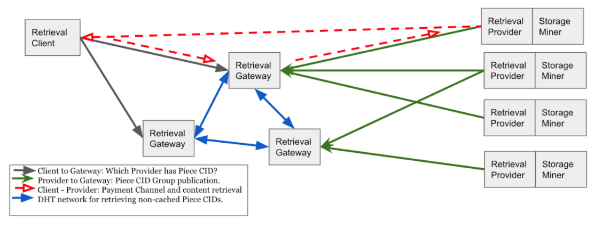

[Back: Terminology](terminology.md)

# Core Architecture

The diagram below shows the core architecture of the Filecoin Secondary Retrieval Market system. 

**Figure 1.** Filecoin Secondary Retrieval Core Architecture

If a Retrieval Client knows where some content (a CID within a Piece CID) is stored, then it could choose to contact the Retrieval Provider that can deliver the content directly. The Retrieval Client establishes or re-uses a payment channel with the Retrieval Provider and incrementally pays for and receives content. 

Even if the Retrieval Client knows a Retrieval Provider that has the content, it might choose to not go directly to the Retrieval Provider. It may wish to use the market mechanism described below to attempt to get the content for a lower price or with lower latency and better bandwidth. Also, if the Retrieval Client doesn’t have a payment channel set-up, or have an existing payment channel with adequate funds in it, it may wish to avoid the investment in time and deployed coins required to create a payment channel with the Retrieval Provider or add funds to the existing channel. 

A Retrieval Client may not know on which Retrieval Provider content is stored or what Retrieval Providers exist. In this case the Retrieval Client needs to undertake Content Discovery, the process of determining where content can be obtained, at what price, and at what Quality of Service (QoS). The Retrieval Client contacts one or more Retrieval Gateways that it has pre-existing payment channels established with. The Retrieval Client pays each Retrieval Gateways a fee for returning a list of Retrieval Providers that have the content (Piece CID), along with the price and QoS that the content can be provided for. Note that the Retrieval Gateway is paid a nominal fee even if they do not have information related to the content in their cache. The Retrieval Gateways provide this information in such a way that the Retrieval Client can be sure that the information is reliable. The Retrieval Client can then choose the best Retrieval Provider for them based on the price and QoS. The Retrieval Provider sends content directly to Retrieval Client, with the Retrieval Client sending incremental micropayments as the content arrives. The payments are sent from the Retrieval Client to the Gateway, which then makes a corresponding payment in a pre-existing channel from Gateway to Provider. They request from the Retrieval Provider the particular piece of content they are interested in (CID within a Piece CID).

In some situations, none of the Retrieval Gateways that a Client uses may know which Retrieval Provider has the content available. In this situation, the Client can request a Retrieval Gateway access the Gateway DHT Overlay Network to determine which Retrieval Provider has the content. The Client pays a premium for this service. The Gateway indicates whether it can create a payment channel with the Retrieval Provider. If this is not possible, then the Client creates a channel directly with the Retrieval Provider.

Retrieval Providers are associated directly with a Storage Miner. Retrieval Providers publish to Retrieval Gateways signed sets of content they have available (Piece CIDs), along with the price and QoS that any piece of content in the set can be obtained for, plus an expiry date for this offer. The Retrieval Gateways can use this signed information to prove to Retrieval Clients that the Retrieval Provider has made this offer. The Retrieval Providers publish the signed content sets to any Retrieval Gateway that will accept them.

Retrieval Providers publish signed sets of Piece CIDs to the Gateway DHT Overlay Network. The Retrieval Providers create these sets of Piece CIDs such that the Piece CIDs are close to the Retrieval Gateway’s ID. 

[Next: Offers](offers.md)