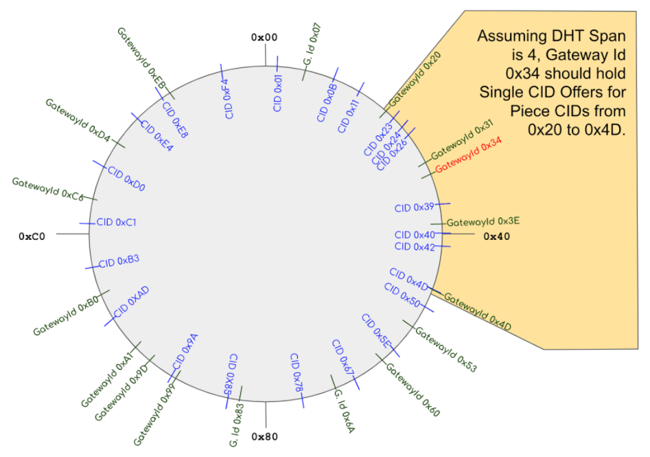

[Back: Offers](offers)

# Retrieval Gateway DHT Network

Retrieval Providers publish CID Group Offers to Retrieval Gateways that wish to listen to CID Group Offers from them. Retrieval Clients can then access offers for content that relate to Piece CIDs directly from Retrieval Gateways. However, some Piece CIDs might not be discoverable using this standard content discovery mechanism as the Retrieval Gateways the Retrieval Client uses might not have the offer information for a given Piece CID. The Retrieval Gateway DHT Network works in conjunction with the standard content discovery mechanism to ensure full coverage of all Piece CIDs.

All Retrieval Gateways must participate in the DHT network. This is in contrast with the standard CID Group Offer publication network, where participation is optional. 

A Retrieval Gateway operating in the DHT overlay network should have Single CID Offers for Piece CIDs that are close to their Retrieval Gateway Id. Close is defined as having the smallest absolute difference:

> Absolute Difference = Absolute Value(Retrieval Gateway Id - Piece CID)

To allow for Retrieval Gateways being offline or for any other reason uncontactable, a range of Gateways should store a Piece CID. The range of Retrieval Gateways is currently defined as the Gateways with the sixteen closest Gateway Ids to the Piece CID. This range is known as the DHT Span. Given Retrieval Gateway Ids are randomly distributed, being the message digest of the Gateway’s root public key, this is likely to mean the eight Gateways with Gateway Ids greater than the Piece CID and the eight Gateways with Gateway Ids less than the Piece CID; however this will not always be the case. In particular, a user could generate many Gateway Root Key Pairs, until the resulting Retrieval Gateway Id was close to their desired value.

It can be imagined that the Retrieval Gateway Ids would be stored in a table that would enable binary searches, or some other sufficiently sized (or re-sized as needed) hash table for O(1) retrieval in high throughput CID lookup.

The list of Retrieval Gateways should be re-fetched from the blockchain regularly. Once per day should be regularly enough to account for new Gateways joining the network.

The methodology should be revisited if there end up being a very large number of Retrieval Gateways. If it was assumed that100 bytes need to be stored per Retrieval Gateway, then storing ten million Retrieval Gateway Ids in a map would use a GByte of RAM on the Gateway.

## DHT Publication Example

Figure 2 shows a simplified DHT Ring. The number range for both Piece CIDs and Gateway Ids is 0x00 to 0xFF. Piece CIDs are uniformly distributed, being the message digest of data. Gateway Ids tend to be uniformly distributed, to maximize profit per Gateway when doing DHT look-ups, as users who wish to run Retrieval Gateways generate Retrieval Gateway Key Pairs until the Gateway Id associated with the key pair is approximately the desired value. That said, the Gateway Ids and Piece CIDs may not be perfectly distributed.

**Figure 2.** Simplified DHT Ring

In the example, the DHT Span is 4 (4 was used rather than 16 to limit the amount of information in the diagram). This means that when Retrieval Providers publish Single CID Offers for a Piece CID they publish it to the Retrieval Gateways with the four closest Gateway Ids. When a Retrieval Gateway starts up, it determines the Gateways with the four closest Gateway Ids, and requests Retrieval Providers deliver Single CID Offers for Piece CIDs in the range from the lowest Gateway Id to the highest Gateway Id. For example, assume Gateway with Gateway Id 0x34 has just started up. It requests Retrieval Providers send it Single CID Offers for Piece CIDs in the range 0x20 to 0x4D.

There is an opportunity for a Gateway to be established with a Gateway Id between 0xEB and 0x07. As Piece CIDs are evenly distributed, DHT requests for Single CID Offers will be evenly distributed around the DHT Ring. Setting up a Gateway with a Gateway Id of 0xF9 is likely to be more profitable than setting up a Gateway with a Gateway Id of 0x32 as the range of Piece CIDs that the Gateway will be closest to is greater. Note that Gateway Ids and Piece CIDs are likely to be 256 bit numbers. In this case, it will be possible to generate a Gateway Id close to the desired number, but not precisely the desired number.

[Next: System Set-up](systemsetup.md)
