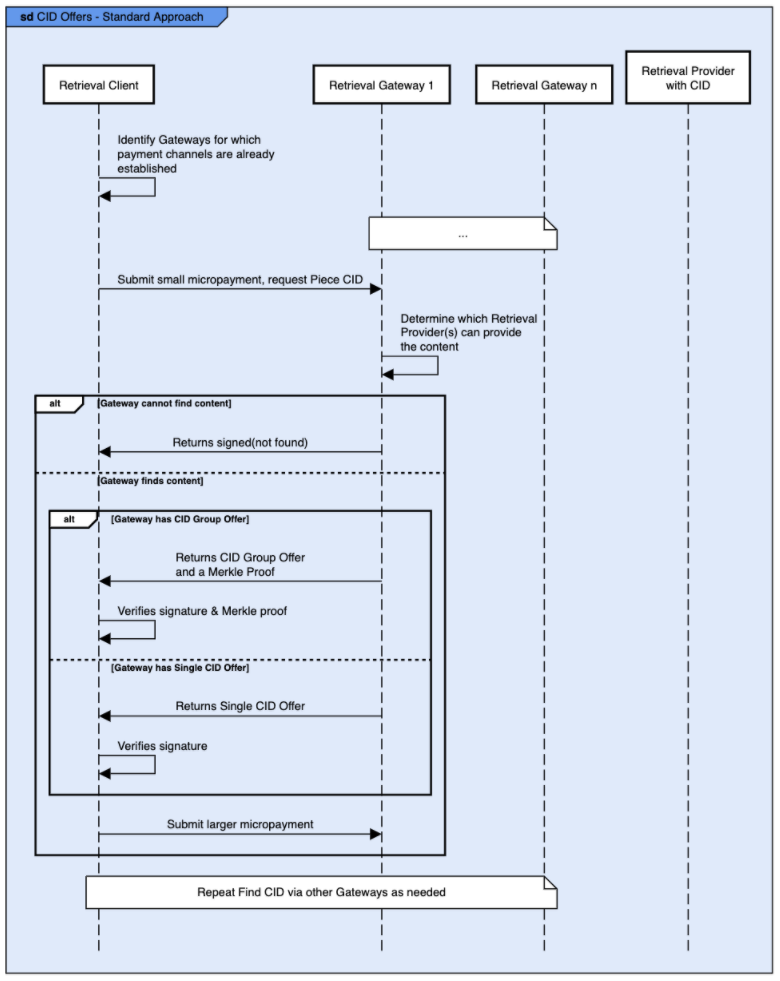
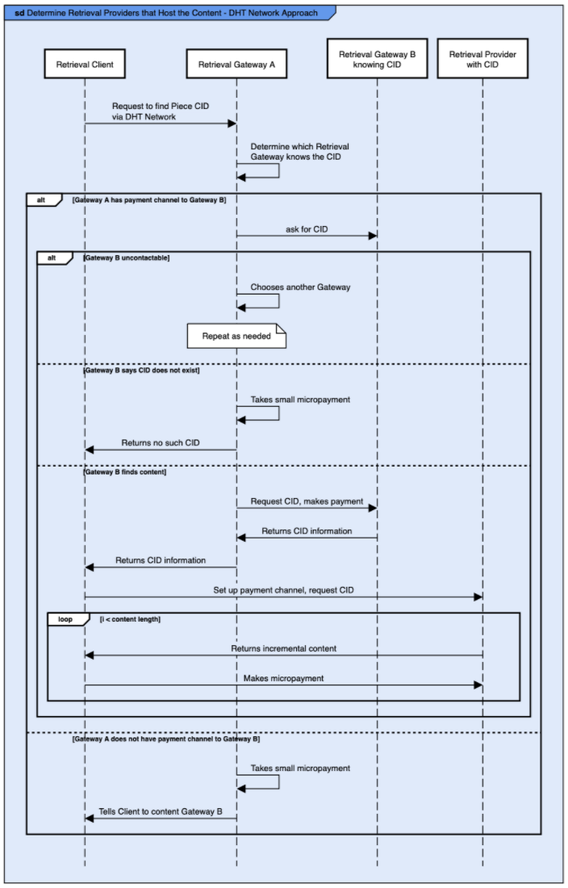

[Back: Retrieval Provider to Retrieval Gateway Publishing](RP2RGpublishing.md)

# Retrieval Client Content Retrieval

## Introduction

Retrieval Clients specify content they want in two ways:

* Content Discovery: They request Retrieval Gateways to find the location of content based on Piece CIDs.
* Content Retrieval: They request Retrieval Providers return content based on a CID and a Piece CID, where the content for the CID is stored inside the Piece CID. 

## Determine Retrieval Providers that Host the Content

### CID Offers / Standard Approach

Retrieval Clients determine which Retrieval Providers have content for a Piece CID by:

* For each Retrieval Gateway the Filecoin Retrieval Client has a payment channel set-up for, submit a small micro-payment and ask each Retrieval Gateway if it knows one or more Retrieval Providers that have the content associated with the Piece CID.
* Retrieval Gateway looks up the map of CID to Retrieval Providers to determine which Retrieval Provider(s) can provide the content.
* If the Retrieval Gateway does not have a CID Group Offer or Single CID Offer for the Piece CID, it returns a message indicating this.
* If the Retrieval Gateway does have information about the Piece CID, it returns for each Retrieval Provider that can deliver the content:
  * The CID Group Offer and a Merkle Proof showing that the Piece CID is contained within the CID Group Offer. The Merkle proof is generated by the Retrieval Gateway.
  * OR a Single CID Offer for the Piece CID.
* The Retrieval Client:
  * Verifies the signature.
  * For CID Offer Groups: verifies the Merkle Proof for each CID Offer Group.
* The Retrieval Client submits a larger micro-payment to each Retrieval Gateway that returned at least one CID Group Offer or Single CID Offer.
  * The Retrieval Client is incentivized to pay the larger micro-payment as they have a long standing relationship with the Retrieval Gateway. Not paying the payment will reduce the Retrieval Gateway’s perception of their reputation.

**Figure 9.** CID Offers - Standard Approach

### DHT Network Approach

If the location of the content for the Piece CID is not found:

* The Retrieval Client makes a small payment via a Payment Channel and asks one Retrieval Gateway to search the DHT network. It specifies the number of Retrieval Gateways the first Gateway should query for offers for the Piece CID.
  * Note that this search will be a single hop.
  * Requesting information from multiple Gateways allows the system to mitigate Sybil attacks, where a malicious Retrieval Gateway either indicates that there are no offers for the Piece CID or indicates only offers for the Piece CID that are offered by Retrieval Providers associated with the malicious Gateway.
* The Retrieval Gateway (Gateway A) determines the sixteen numerically nearest Retrieval Gateway IDs to the Piece CID. Call these Retrieval Gateways the Near Gateway Set.
* Gateway A uses the following process until it has Offers from enough Retrieval Gateways, or until it has run out of Gateways in the Near Gateway Set.
For each Retrieval Gateway in the Near Gateway Set, starting with the Gateway that is numerically closest to the Piece CID and progressing to the Id furthest away:
  * If the Gateway A has a payment channel with the Retrieval Gateway then:
    * Gateway A asks the Retrieval Gateway for the Piece CID.
      * If the Retrieval Gateway is uncontactable, then Gateway A proceeds to the next Gateway in the set.
      * If the Retrieval Gateway returns a signed response saying the Piece CID does not exist then Gateway A adds this to the list of results and proceeds to the next Gateway in the set. 
    * Gateway A pays for the CID retrieval, gets the CID information, and stores it locally in its cache. The CID offer information is added to the list of information to return.
      * If Gateway A does not pay then its reputation from the perspective of the other Retrieval Gateway will be affected.
  * If the Gateway A does not have a payment channel with the Gateway B then:
    * It adds this information to the list of information to return to the Client, and proceeds to the next Retrieval Gateway in the set.
    * NOTE: when Payment Brokers are available Gateway A could use the Payment Broker.
* Gateway A returns to the client the list of CID offer information / indication that Gateway A didn’t have a payment channel / signed response from a Retrieval Gateway indicating that no offer information is available for the Piece CID.
  * In the response, in the event Gateway A has a payment channel with the Provider, they can offer to broker the payment channel.
  * However, the Retrieval Gateway is unlikely to have a payment channel set-up with the Provider. If they did, then they would have had the Piece CID cached. In this case, the Client sets-up a payment channel with the Retrieval Provider directly.
* Note: The payment for this should be larger than normal retrieval. Retrieval Gateways are incentivized to not wait for this payment, because the Client may find another Gateway who will return the CID information using the normal methodology, and the Gateway’s reputation with the Client will suffer if they never initially return CID information.

**Figure 10.** Determine Retrieval Providers that Host the Content - DHT Network Approach

## Selection of Best Retrieval Provider Algorithm

Note: In general, Retrieval Gateways only return CID Group information for Retrieval Providers they have a relationship with. Hence, in the paragraphs below, it is assumed that the Retrieval Gateway will create a payment state channel between the Client the Provider.

After the Retrieval Client has a list of Retrieval Providers, it needs to determine which one to use. The Retrieval Client could be configured for certain metrics. Here are some thoughts:

* The Retrieval Client should know the latency to the Retrieval Providers. 
  * It could cache ping times to Retrieval Providers it has used before.
  * If the file retrieval isn’t too time critical it could ping the Retrieval Providers it hasn’t used before.

Algorithm:

* Assume the config settings are:
  * Price: what is the maximum price to pay.
  * Latency to first byte: what is the maximum latency that is acceptable. Latency will be the sum of round trip latency to the Retrieval Provider + latency for Retrieval Provider to send the first piece after the initial payment.
  * Price preferred over latency or latency over price.
* Remove all Retrieval Providers that are on the Retrieval Client’s banned list.
  * A Retrieval Provider is put on the Client’s banned list if they don’t deliver a file.
* Remove all Retrieval Providers that want to be paid more than the configured maximum price.
* Remove all Retrieval Providers that can’t deliver the file quickly enough based on the latency to first byte information.
* If any Retrieval Providers are remaining, choose the cheapest or lowest latency, depending on the configuration.
* If no Retrieval Providers are remaining, return the list of Retrieval Providers to the user and the reasons why they were not chosen.

[Next: Retrieval Gateway Storage and Caching](rgstorageandcaching.md)