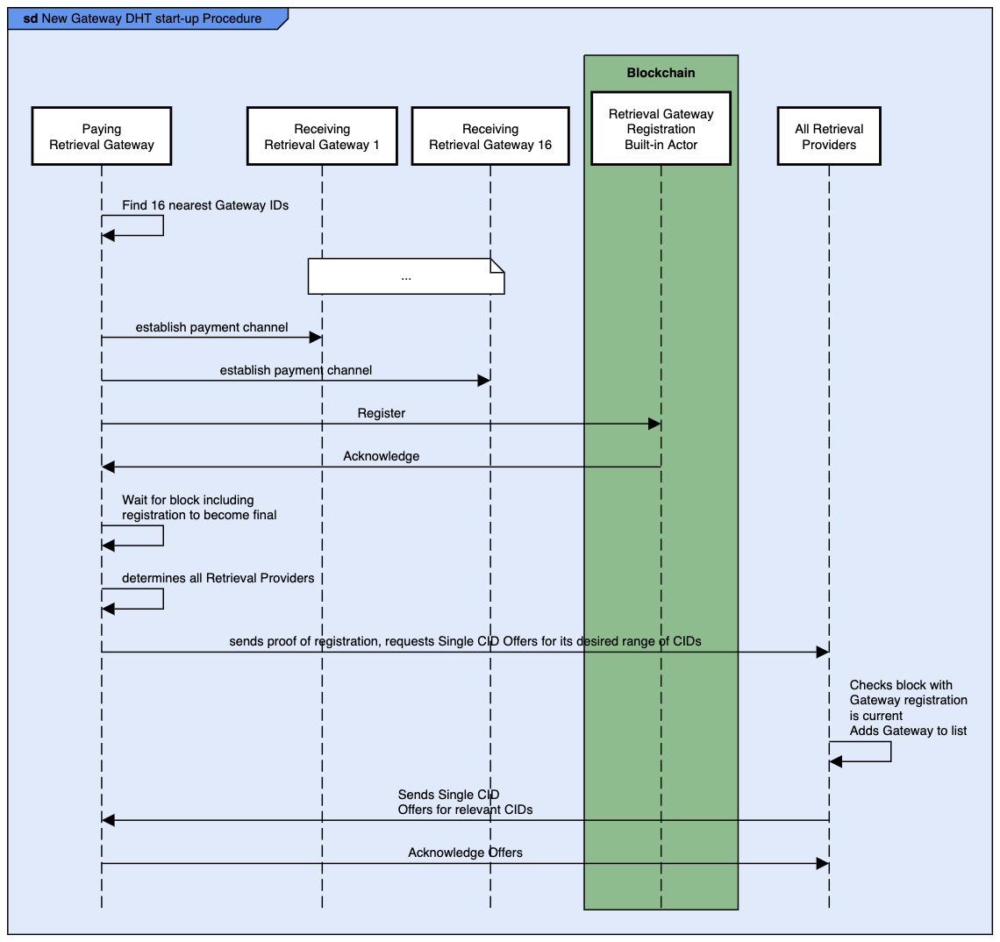

[Back: Retrieval Gateway DHT Network](dhtnetwork.md)

# System Set-up

## Node Registration

Retrieval Providers and Retrieval Gateways should register on the Filecoin blockchain in a similar way to how Storage Miners register. That is a transaction that should be submitted to a Build-in Actor on the Filecoin blockchain (this is similar to a pre-compiled contract in Ethereum). The transactions need to become final before the node should be considered registered.

### Retrieval Provider Registration

Administrators of Retrieval Providers register their Retrieval Provider(s) with the Filecoin Blockchain’s Retrieval Provider Registration Built-in Actor. They register their Retrieval Providers so that Retrieval Clients and Retrieval Gateways can find them. In addition to the registration information shown below, a deposit must also be transferred as part of the registration transaction.

The information to be registered is:

* Retrieval provider Root Signing Public Key: This registration and any updates need to be signed by the private key associated with this public key.
* Network addressing information (typically IP Address and Port)
* Retrieval Provider Signing Public Key: Used for signing CID Group Offers and Single CID Offers.
  * Note that the key pair that this public key is a part of must be separate from the Retrieval Provider Root Signing key pair. The reasons for having different key pairs are:
    * Key sizes and algorithms: They may be different algorithms and key sizes. Using a larger key size, stronger algorithm for the Root key makes sense as it is used for signing irregularly. The algorithm needs to be chosen such that the verification time is still reasonable. The Retrieval Provider Signing Public Key is used frequently online to sign CID Offers. The algorithm needs to be fast to sign and to verify.
    * Key life-time: They are likely to have different life times. That is, the roll-over time for the Retrieval Provider Signing Public Key is going to be shorter than the Root Key as the Retrieval Provider Signing Public Key will be more exposed and hence could be compromised, and because it will be used to sign more data, thus increasing the probability of crypto algorithmic attacks.
    * Revocation: The private key associated with the Retrieval Provider Signing Public Key is going to be more exposed. It needs to be available for regular usage. As such, it is more likely to be compromised either by being taken or being used to sign malicious content. 
    * Key storage: The Root Key should probably be stored offline or on an air-gapped network. The Retrieval Provider Signing Public Key needs to be available for online usage as it is in constant use.
    * Non-repudiation: having two uses for a key may mean that two entities need access to the private key. This makes non-repudiation harder as two entities have access to the private key.
* Region code (A = Australia Pacific, B = Sub-Saharan Africa, C = North and West Africa, E = Europe, F = West and Southern Asia, G = East Asia, N = North America, S = South America, Z = Antarctica) and ISO 3166-1 alpha-2 two letter country code, and ISO 3166-1 alpha-2 two letter sub-division code (see https://en.wikipedia.org/wiki/ISO_3166-1_alpha-2 and for example: https://en.wikipedia.org/wiki/ISO_3166-2:IN). For example, Australia is AU, and Gujarat, India would be IN-GJ.
  * The purpose of the Region Code is to have something bigger than country level, group countries that will be electronically close to each other.
  * NOTE: Using latitude and longitude had been considered. However, the CPU requirements for calculating the distance between a prospective node and existing nodes would be much higher than a simple classification mechanism.
* Filecoin Account to be used with payment channels.

** Figure 3.** Retrieval Provider Registration

### Retrieval Gateway Registration

Administrators of Retrieval Gateways register their Retrieval Gateway(s) with the Filecoin Blockchain’s Retrieval Gateway Registration Built-in Actor. They register their Retrieval Providers so that Retrieval Clients, other Retrieval Gateways, and Retrieval Providers can find them. In addition to the registration information shown below, a deposit must also be transferred as part of the registration transaction. Requiring a registration deposit increases the cost of and reduces the probability of spam or malicious registrations.

The information to be registered is:

* Retrieval Gateway Root Signing Public Key: This registration and any updates need to be signed by the private key associated with this public key.
  * The Retrieval Gateway ID is the message digest of this public key.
* Network addressing information (typically IP Address and Port)
* ISO 3166-1 alpha-2 two letter country code, and ISO 3166-1 alpha-2 two letter sub-division code (see https://en.wikipedia.org/wiki/ISO_3166-1_alpha-2 and for example: https://en.wikipedia.org/wiki/ISO_3166-2:IN). For example, Australia is AU, and Gujarat, India would be IN-GJ.
* Filecoin Address for payments.

Note that Retrieval Gateway Registration is part of the much larger Retrieval Gateway start-up process, outlined here: [New Gateway DHT start-up Procedure](TODO).

**Figure 4.** Retrieval Gateway Registration

### Registration Notes

The following applies to both Retrieval Providers and Retrieval Gateways.

Additional Notes:

* Registration is rejected if the Retrieval Gateway ID / Provider ID exists (that is if the Root Signing Public Key exists).
* At present, there is no mechanism for forcibly removing Gateways from the Built-in Actors, whether they be maliciously registered or if a user loses their private key.
  * Malicious registrations for Gateways at IP addresses, where there is no Gateway will be detected because no web service will operate.
  * Proof of possession of the Root Signing Private Key protocol ensures the IP address and service for a particular Gateway can not be hijacked by a malicious registration.
  * The Gateways could also be “verified”. See Retrieval Gateway Registration Built-in Actor: Lists Retrieval Gateways for more information.
* Deregistration: 
  * An owner of a Gateway can deregister the Gateway, and obtain a refund on their deposit.
  * A Gateway is deregistered if a Client submits proof that the Gateway is not servicing DHT requests correctly. In particular, the Client submits the signed acknowledgement that the Provider published the Piece CID to the Gateway and the signed response from the Gateway saying the Piece CID does not exist.

## Node Discovery

### Retrieval Gateway Registration Built-in Actor: Lists Retrieval Gateways

The Retrieval Gateway Registration Built-in Actor has a function to provide lists of all Retrieval Gateways:

* Parameters to the call are:
  * Region Code
  * OR ISO 3166-1 alpha-2 two letter country code
  * OR ISO 3166-1 alpha-2 two letter country code, and ISO 3166-1 alpha-2 two letter sub-division code.
  * The maximum number of Gateway Ids to return. Call this MAX_GATEWAY_IDS.
  * Note: The request can also be for the contract to return all Gateway Ids for all regions.
* Call returns:
  * A list of all Retrieval Gateways that are specified for the location. The maximum number returned is the number specified in the parameter, MAX_GATEWAY_IDS. If the request was region or country based and there are more than the number of gateways requested for the region / country, then return an error and request a more specific search.
If there are more than the number of requested Retrieval Gateways in a subdivision then use the following algorithm to determine which Gateways to return is used:
    * Define the total number of Retrieval Gateways available in the requested location as TOTAL.
    * OFFSET = CPU (Nano-second count / 1000) mod TOTAL
      * Note using ms rather than ns just in case the ns value is artificial, and hence might not yield an even distribution.
    * Loop MAX_GATEWAY_IDS times:
      * Add the Retrieval Gateway at OFFSET
      * OFFSET = (OFFSET + 1) mod TOTAL
* NOTE: This design assumes that Filecoin Built-in Actors will operate in a similar way to Ethereum Smart Contracts. That is, calls that read values from the blockchain, execute against a node’s local copy of the distributed ledger. Thus the computationally expensive calls above are intended to execute on a single node, and in particular are not intended to be executed by all nodes in the blockchain. The node that these calls are executed on could be a “read-only” node, which is only used for executing View Calls.

Consideration should be given to having entries as “Verified”. Clients would preferentially use verified gateways. The “verified” status would by default be on. The “verified” status could be switched off by the same entities involved in “verified data”.

**Figure 5.** List of Retrieval Gateways

### Retrieval Client discovery of Retrieval Gateways

Retrieval Clients use the Retrieval Gateway Registration Built-in Actor to discover Retrieval Gateways near them. 

The Client verifies that each Gateway listed in the contract has matching IP address and public key information. The methodology for this is:

* Send a Client - Gateway Establishment Challenge message containing a random challenge.
* Verify the signature in the Gateway Response message.
* Store the round-trip delay. The Retrieval Client uses the round-trip delay as the starting point averaged round-trip delay with the Retrieval Gateway.
  * Note: Using averaged round-trip delay is better than using an initial “ping” round-trip to determine probable latency for future requests as a node could purposefully respond to “pings” quickly in order to trick Clients into perceiving their latency to be low.

If the latency of all of the Gateways seems “higher” than the Client was expecting, then the Client could go back to the Retrieval Gateway Registration Built-in Actor to determine a new set of Gateways that are close by. The definition of “high” latency is geo-specific. As such, this should be set-able as a configuration item.

The Client chooses the set of Retrieval Gateways that have lowest latency and sets up payment channels with them. The size of the set is configurable.

**Figure 6.**  Retrieval Client discovery of Retrieval Gateways

### Retrieval Provider discovery of Retrieval Gateways

Retrieval Providers use the Retrieval Gateway Registration Built-in Actor to discover all Retrieval Gateways, as shown in Figure 7. Retrieval Providers create direct connections with all Retrieval Gateways so they can provide content lists.

### New Retrieval Gateway DHT start-up Procedure

New Retrieval Gateways need to determine the Piece CIDs that are close to their Gateway Id. 

Retrieval Gateways need to maintain the current list of Gateways. They need this so that they are ready to quickly determine which Retrieval Gateways will hold the location mapping record for a Piece CID. They obtain the list from the Retrieval Gateway Registration Built-in Actor, as shown in Figure 7.  To keep the list up to date, Retrieval Gateways need to re-read this information from the Retrieval Gateway Registration Built-in Actor once every 24 hours.

The procedure for a new Retrieval Gateway gathering Piece CIDs that are close to their Gateway is:

* A new Retrieval Gateway determines the sixteen Gateways that have the nearest Gateway Ids to their Gateway Id by calling the Retrieval Gateway Registration Built-in Actor. Of the sixteen, the Retrieval Gateway Id that is lowest is called Lowest Gateway Id, and the Gateway Id that is highest is called Highest Gateway Id. 
  * The Retrieval Gateway wants to obtain CID Offers for all CIDs that are within the DHT Span. That is, lie in the range between Lowest Gateway Id and the Highest Gateway Id. 
* The new Retrieval Gateway sets up payment channels with the Gateways of the sixteen Gateways that have Retrieval Gateway Ids above the new Gateway’s Retrieval Gateway Id.
  * This is needed so a Retrieval Gateway can query other Gateways with nearby Retrieval Gateway Ids when the Gateway first starts up, before it has all of the CID Offers in the range it needs to cover.
* The Retrieval Gateway registers in the Gateway Registration Built-in Actor.
* The Retrieval Gateway waits for the block that the registration transaction is in to become final.
* The Retrieval Gateway determines all Retrieval Providers by accessing the Retrieval Provider Registration Built-in Actor.
* For each Retrieval Provider:
  * The Retrieval Gateway sends the following in a message:
    * The Retrieval Gateway provides a proof that they have registered on the blockchain. This will take the form of a Merkle Proof for the transaction receipt, with the emitted event information coming from the Gateway Registration Built-in Actor with information indicating the Retrieval Gateway Id has been registered.
    * The Retrieval Gateway will indicate whether it would like to be added to CID Group Offer publication for the Retrieval Provider.
    * The Retrieval Gateway requests Single CID Offers for all CIDs in the range between the Lowest Retrieval Gateway Id and the Highest Retrieval Gateway Id. 
  * The Provider will check that the block hash that is referred to relates to a recently (last two hours maybe) mined block.
  * The Provider will add the Retrieval Gateway to their list of Retrieval Gateways to publish for the DHT Network, and depending on the CID Group Offer parameter, add the Retrieval Gateway to the CID Group Offer network for this Provider.
  * The Provider sends Single CID Offers to the Retrieval Gateway for all CIDs in the range between Lowest Gateway Id and Highest Gateway Id. 

Retrieval Gateways re-read the Retrieval Gateway Registration Built-in Actor each 24 hours to ensure they have the current list of all Retrieval Gateway Ids.

Retrieval Gateways re-read the Retrieval Provider Built-in Actor each 24 hours to ensure they have the current list of all Provider Ids. They execute the set-up procedure with each new Retrieval Provider.

While the new Retrieval Gateway is setting-up, it may receive a DHT request to supply a Single CID Offer for a Piece CID. The Retrieval Gateway contacts the Gateway with the next highest Retrieval Gateway Id, requesting the Single CID Offer. As the Retrieval Gateway has a payment channel set-up with this Gateway, it will be able to pay for the information. 

**Figure 7.** New Retrieval Gateway DHT start-up Procedure

## Payment Channel Set-up

To set-up a payment channel between a Retrieval Client and a Retrieval Gateway or a Retrieval Provider, the following occurs:

* The *payer* triggers the creation of a payment channel e.g. by calling [PaychGet](https://github.com/filecoin-project/lotus/blob/master/api/api_full.go#L414) on the lotus node. This will create a new payment channel actor for payments to the *receiver*, and deposit funds into it.
* To make a payment the payer must open a lane in the payment channel. They can then make payments to the receiver by issuing vouchers in this lane.
* A new payment channel is only required if there is no existing channel, or if all of the funds from any existing channels have already been used. Otherwise, the payer can reuse an existing channel by opening a new lane in that channel.

A payment channel between a Retrieval Client and a Retrieval Gateway or a Retrieval Provider can be reused if the following conditions are met:

* There are still sufficient unspent funds in the payment channel, and the maximum lane limit hasn’t been reached. Note that it is possible to top up payment channels, which may be more cost (gas?) effective than creating new actors.

[Next: Retrieval Provider to Retrieval Gateway Publishing](RP2RGpublishing.md)